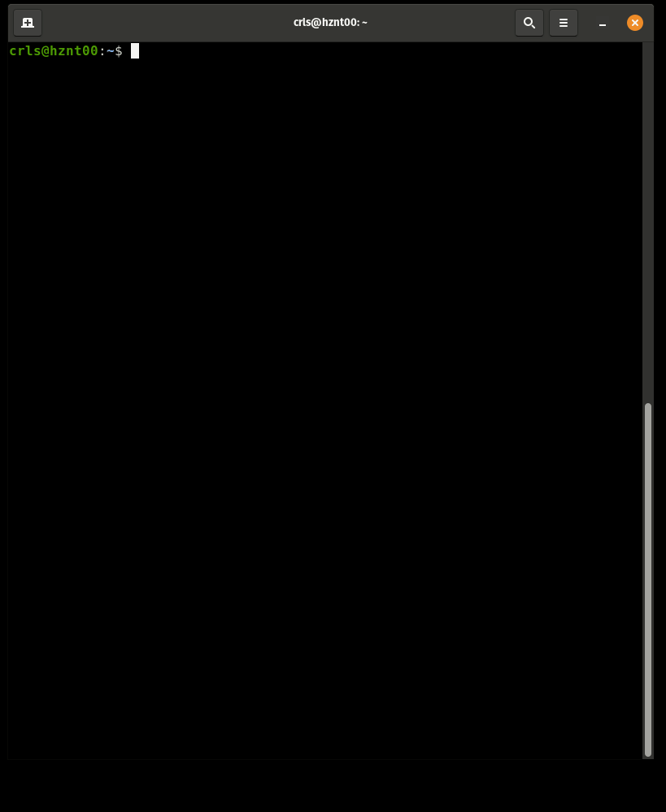

# monitor.ricohpel

Um scritp para monitoramento de equipamentos de rede e sites que fiz enquanto trabalhei na Ricohpel.

Monitora hosts (ping) e sites (curl) de forma ativa e envia uma notificação de push na tela em caso de falha.

Foi um dos primeiros scripts que eu fiz.

